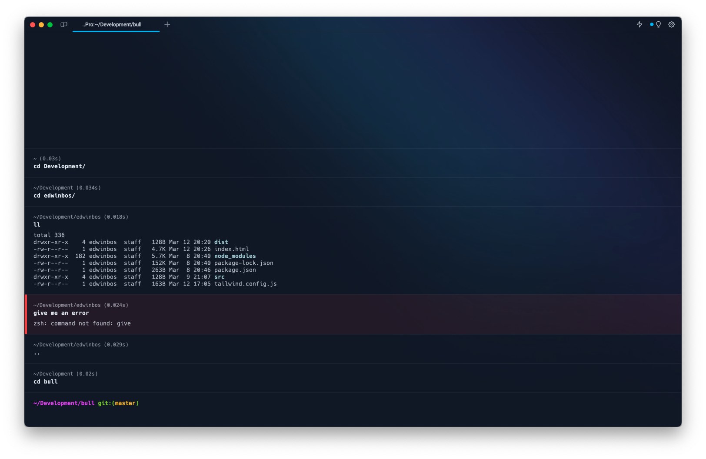

# Warp Theme Tailwarp

This is a Warp theme that is inspired by the dark mode of [the Tailwind site](https://tailwindcss.com). Colors coming from [the Tailwind color pallette](https://tailwindcss.com/docs/customizing-colors)

## Installation
To kown more about custom themes read the [Warp Documentation about Custom Themes](https://docs.warp.dev/appearance/custom-themes).

Copy the content of `themes` into `~/.warp/themes`.

Restart Warp and go to `Warp → Preferences → Appearance...` and select the Tailwarp theme.

## Preview

## Not using Warp?
[Download Warp](https://app.warp.dev/referral/2REEM7)